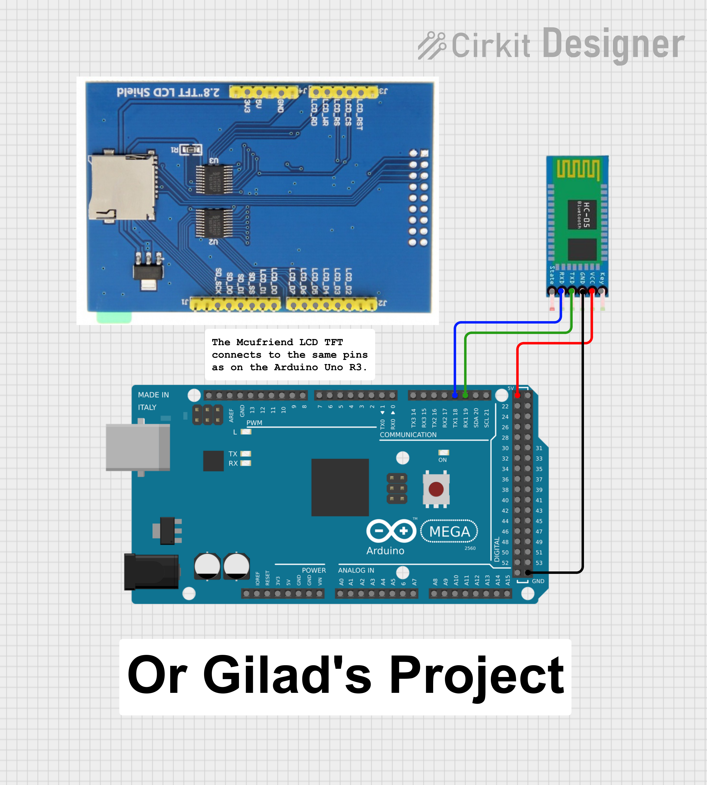

# Arduino_Mega_2560_Bluetooth_Notice_Board

***TO MAKE THE CODE WORK NEED TO INSTALL ARDUINO BLUETOOTH CONTROL APP AND USE - TERMINAL***
https://play.google.com/store/apps/details?id=com.broxcode.arduinobluetoothfree

